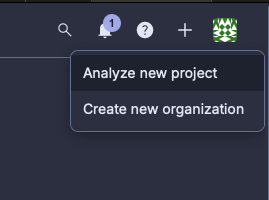
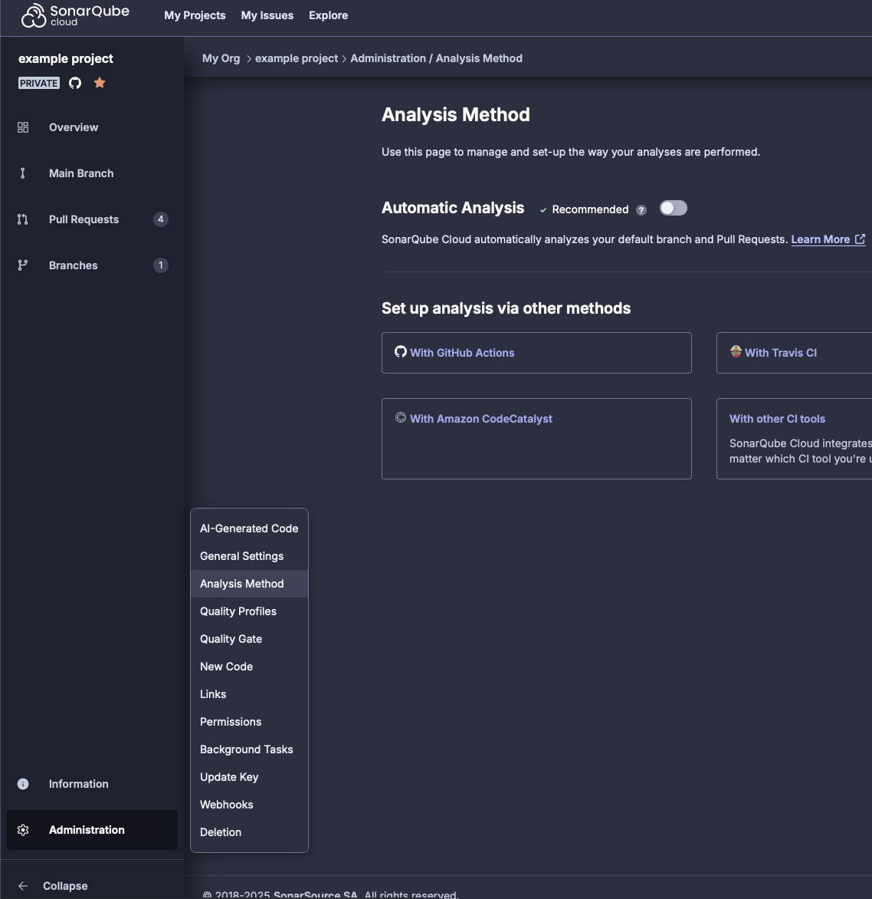

# SonarQube

This short guide will help you set up SonarQube for your project.

## Creating a new project in SonarQube

1. So lets assume you have a project and you want to add it to SonarQube. First you need to create a new project in
SonarQube. To do that, you need to login to SonarQube and click on the "+" in the top right corner and select
"Analyse new project". Search for your project and click on "Set Up".
2. You are presented with the option to choose how to define new code. You can choose between "Previous version" and
"Number of days". For now choose "Number of days" and set the number to "30" days. Finally press the
"Create Project". (You can always change this later).

## Setting up the SonarQube Scanner

Depending wether the project already contains a `sonar-project.properties` file or not, it will start analyzing the
project in whats called the "Automatic Analysis" mode (in case the sonar config file is missing). Because we probably
also want "Coverage analysus" we want to change the "Analysis Method" to non-automatic.To do this, click on the
"Administration" tab (in the left bottom side menu) and select "Analysis Method" and change it to "Manual" (its an
toggle).

Finally in the same screen press on "With Github Actions" and follow the instructions. It will guide you through the
process of adding the `SONAR_TOKEN` to your Github repository secrets. Remember to also add the `SONAR_TOKEN` to the
Dependabot secrets. It's a separate page with it own secerts.

The last step is to add the `sonar-project.properties` file to your project. This file should be placed in the root of
your project and should contain the following. You will also need to add the the job/workflow to your
`.github/workflows` folder.

The necessary files and configuration should already exist in this project so you will only have to review the
`sonar-project.properties` file.

